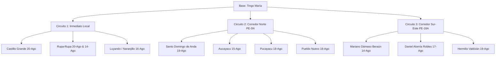

# 🛰️ Matriz y Guía de Salidas a Campo: Verificación de Quemas Satelitales (FIRMS)
**Proyecto de Tesis:** Monitoreo y Validación de Anomalías Térmicas / Quemas Agrícolas en la Provincia de Leoncio Prado (Huánuco)  
**Fecha de Corte de Datos:** 20 de Agosto de 2026  
**Total de Eventos Registrados:** 12 eventos validados  

---

## 📌 1. Importancia Científica para la Tesis (Ground Truthing / Verdad de Terreno)

En la región de selva alta (*Rupa-Rupa*), las condiciones de alta humedad, precipitación tropical y rápida dinámica de vegetación hacen que la **ventana temporal óptima para validación en campo sea de 24 a 72 horas** posteriores a la detección satelital:
* **0 a 48 horas:** Presencia de ceniza fresca, brasas o humo residual, límites nítidos de la cicatriz de quema, fácil identificación del tipo de biomasa combustible original.
* **3 a 7 días:** La lluvia lixivia la ceniza y arrastra carbón; la vegetación pionera o rebrotes comienzan a enmascarar la severidad.
* **> 7 días:** La delimitación exacta del perímetro de la quema se vuelve difusa.

---

## 🚨 2. Priorización de Salidas a Campo (Orden de Urgencia)

| Prioridad | Antigüedad | Distritos Clave | Justificación de Salida |
| :--- | :--- | :--- | :--- |
| 🔴 **URGENCIA MÁXIMA (Nivel 1)** | **Hoy (20 Ago 2026)** | Castillo Grande, Rupa-Rupa | Quemas activas/del día. Muestreo de ceniza fresca y condiciones in situ intactas. |
| 🟠 **URGENCIA ALTA (Nivel 2)** | **Ayer (19 Ago 2026)** | Hermilio Valdizán, Santo Domingo de Anda | Quemas de 24h con alta potencia radiativa (MODIS 28.4 MW). Cicatrices frescas. |
| 🟡 **PRIORIDAD MEDIA-ALTA (Nivel 3)** | **2-3 días (17-18 Ago)** | Pucayacu, Pueblo Nuevo, Daniel Alomía Robles | Evidencia de quema muy visible, posible carbón y afectación de fuste/copa. |
| 🟢 **PRIORIDAD SEGUIMIENTO (Nivel 4)** | **4-6 días (14-16 Ago)** | Luyando, José Crespo y Castillo, Mariano Dámaso Beraún | Validación de cicatriz y cálculo de severidad retrospectiva (NBR / dNBR). |

---

## 🗺️ 3. Catálogo Detallado de Eventos para Ir a Campo

A continuación se presentan los 12 eventos ordenados cronológicamente desde el más reciente (mayor urgencia de visita) con su enlace directo a GPS / Google Maps:

### 🔴 GRUPO 1: Quemas de Hoy (20 de Agosto de 2026) — *Ir Cuanto Antes*

#### 1. Foco Castillo Grande (Periurbano / Agrícola)
* **Distrito:** Castillo Grande
* **Coordenadas:** `-9.2541, -76.0125` ➡️ [Abrir en Google Maps](https://www.google.com/maps?q=-9.2541,-76.0125)
* **Fecha y Hora:** 2026-08-20 | 18:20 UTC (13:20 hora local Perú)
* **Sensor / Satélite:** VIIRS (NOAA-20 NRT) | Confianza: **Alta (h)**
* **Potencia Radiativa (FRP):** 19.2 MW | Temp. Brillo: 346.0 K
* **Observación para Tesis:** Ubicado en la margen derecha del río Huallaga cerca a Tingo María. Ideal para salida inmediata en mototaxi o camioneta.

#### 2. Foco Rupa-Rupa (Sector Oeste)
* **Distrito:** Rupa-Rupa
* **Coordenadas:** `-9.1240, -76.1850` ➡️ [Abrir en Google Maps](https://www.google.com/maps?q=-9.1240,-76.1850)
* **Fecha y Hora:** 2026-08-20 | 18:20 UTC (13:20 hora local Perú)
* **Sensor / Satélite:** VIIRS (Suomi-NPP NRT) | Confianza: **Nominal (n)**
* **Potencia Radiativa (FRP):** 15.6 MW | Temp. Brillo: 340.2 K
* **Observación para Tesis:** Sector rural/agrícola al noroeste de Tingo María.

---

### 🟠 GRUPO 2: Quemas de Ayer (19 de Agosto de 2026) — *Ventana de 24 Horas*

#### 3. Foco Hermilio Valdizán (Alta Intensidad Térmica)
* **Distrito:** Hermilio Valdizán
* **Coordenadas:** `-9.3512, -75.7610` ➡️ [Abrir en Google Maps](https://www.google.com/maps?q=-9.3512,-75.7610)
* **Fecha y Hora:** 2026-08-19 | 15:25 UTC (10:25 hora local Perú)
* **Sensor / Satélite:** MODIS (Aqua NRT) | Confianza: **84%**
* **Potencia Radiativa (FRP):** **28.4 MW** (Intensidad muy alta) | Temp. Brillo: 328.0 K
* **Observación para Tesis:** Foco de gran escala detectado por MODIS (pixel 1 km). Verificar si fue roce de purma o quema en plantaciones de café/cacao.

#### 4. Foco Santo Domingo de Anda
* **Distrito:** Santo Domingo de Anda
* **Coordenadas:** `-9.0815, -75.8820` ➡️ [Abrir en Google Maps](https://www.google.com/maps?q=-9.0815,-75.8820)
* **Fecha y Hora:** 2026-08-19 | 18:40 UTC (13:40 hora local Perú)
* **Sensor / Satélite:** VIIRS (NOAA-20 NRT) | Confianza: **Nominal (n)**
* **Potencia Radiativa (FRP):** 14.8 MW | Temp. Brillo: 339.4 K
* **Observación para Tesis:** Acceso por la Carretera Fernando Belaúnde Terry (PE-5N) hacia el norte.

---

### 🟡 GRUPO 3: Quemas de 2 a 3 Días (17 - 18 de Agosto de 2026)

#### 5. Foco Pucayacu (Norte Provincial)
* **Distrito:** Pucayacu
* **Coordenadas:** `-8.7512, -76.1245` ➡️ [Abrir en Google Maps](https://www.google.com/maps?q=-8.7512,-76.1245)
* **Fecha y Hora:** 2026-08-18 | 17:58 UTC (12:58 hora local Perú)
* **Sensor / Satélite:** VIIRS (Suomi-NPP NRT) | Confianza: **Alta (h)**
* **Potencia Radiativa (FRP):** 21.0 MW | Temp. Brillo: 350.2 K

#### 6. Foco Pueblo Nuevo
* **Distrito:** Pueblo Nuevo
* **Coordenadas:** `-8.6210, -76.1950` ➡️ [Abrir en Google Maps](https://www.google.com/maps?q=-8.6210,-76.1950)
* **Fecha y Hora:** 2026-08-18 | 17:58 UTC (12:58 hora local Perú)
* **Sensor / Satélite:** VIIRS (Suomi-NPP NRT) | Confianza: **Nominal (n)**
* **Potencia Radiativa (FRP):** 11.2 MW | Temp. Brillo: 335.7 K

#### 7. Foco Daniel Alomía Robles (Pumahuasi)
* **Distrito:** Daniel Alomía Robles
* **Coordenadas:** `-9.4510, -75.8210` ➡️ [Abrir en Google Maps](https://www.google.com/maps?q=-9.4510,-75.8210)
* **Fecha y Hora:** 2026-08-17 | 18:12 UTC (13:12 hora local Perú)
* **Sensor / Satélite:** VIIRS (NOAA-20 NRT) | Confianza: **Alta (h)**
* **Potencia Radiativa (FRP):** 16.5 MW | Temp. Brillo: 344.8 K
* **Observación para Tesis:** Ruta este hacia Pucallpa por la carretera PE-18A.

---

### 🟢 GRUPO 4: Quemas de 4 a 6 Días (14 - 16 de Agosto de 2026) — *Mapeo de Cicatriz*

#### 8. Foco Luyando (Naranjillo - Evento de Mayor FRP)
* **Distrito:** Luyando
* **Coordenadas:** `-9.1824, -75.9120` ➡️ [Abrir en Google Maps](https://www.google.com/maps?q=-9.1824,-75.9120)
* **Fecha y Hora:** 2026-08-16 | 15:10 UTC (10:10 hora local Perú)
* **Sensor / Satélite:** MODIS (Terra NRT) | Confianza: **78%**
* **Potencia Radiativa (FRP):** **32.6 MW** (El más potente del registro) | Temp. Brillo: 324.5 K
* **Observación para Tesis:** Muy cercano a Tingo María (valle de Naranjillo). Excelente candidato para medir el área total quemada en hectáreas.

#### 9 y 10. Clúster José Crespo y Castillo (Aucayacu)
* **Distrito:** José Crespo y Castillo
* **Punto A:** `-8.9241, -76.0412` (FRP: 24.8 MW, Confianza Alta) ➡️ [Abrir en Google Maps](https://www.google.com/maps?q=-8.9241,-76.0412)
* **Punto B:** `-8.9180, -76.0350` (FRP: 12.3 MW, Confianza Nominal) ➡️ [Abrir en Google Maps](https://www.google.com/maps?q=-8.9180,-76.0350)
* **Fecha y Hora:** 2026-08-15 | 17:45 UTC
* **Sensor / Satélite:** VIIRS (Suomi-NPP NRT)
* **Observación para Tesis:** Ambos puntos distan menos de 1 km entre sí; corresponden a un mismo frente de quema o predios agrícolas vecinos.

#### 11. Foco Rupa-Rupa (Histórico Inicial)
* **Distrito:** Rupa-Rupa
* **Coordenadas:** `-9.2845, -75.9721` ➡️ [Abrir en Google Maps](https://www.google.com/maps?q=-9.2845,-75.9721)
* **Fecha y Hora:** 2026-08-14 | 18:30 UTC
* **Sensor / Satélite:** VIIRS (NOAA-20 NRT) | FRP: 18.4 MW

#### 12. Foco Mariano Dámaso Beraún (Las Palmas / Cueva de las Pavas)
* **Distrito:** Mariano Dámaso Beraún
* **Coordenadas:** `-9.3120, -75.9450` ➡️ [Abrir en Google Maps](https://www.google.com/maps?q=-9.3120,-75.9450)
* **Fecha y Hora:** 2026-08-14 | 18:30 UTC
* **Sensor / Satélite:** VIIRS (NOAA-20 NRT) | FRP: 9.7 MW

---

## 🚗 4. Circuitos Logísticos Recomendados para Salidas desde Tingo María

Para optimizar tiempo y combustible en tu trabajo de campo de tesis:



---

## 📋 5. Ficha de Registro de Campo para Tesis (Ground Truth Form)

Copia o imprime este formato para cada punto que visites:

```markdown
================================================================================
FICHA DE VERIFICACIÓN DE QUEMA EN CAMPO (GROUND TRUTHING) - TESIS
================================================================================
N° de Foco / ID: _______________       Fecha de Visita: _____/_____/2026
Distrito: ______________________       Hora de Visita:  _____:_____ AM/PM
Coordenadas GPS Satélite: Lat: _______________  Lon: _______________
Coordenadas GPS Campo:    Lat: _______________  Lon: _______________  Altitud: _____ msnm

1. ESTADO ACTUAL DEL EVENTO:
   [ ] Fuego activo visible / llamas
   [ ] Humo / brazas residuales
   [ ] Ceniza reciente (negra/gris fresca)
   [ ] Suelo quemado lixiviado (lluvia reciente)
   [ ] No se observa evidencia de fuego (Posible Falso Positivo / Techo de calamina caliente)

2. TIPO DE COBERTURA VEGETAL AFECTADA:
   [ ] Purma o bosque secundario
   [ ] Bosque primario / ripario
   [ ] Pastizal para ganadería
   [ ] Rastrojo agrícola (Cacao / Café / Plátano / Maíz)
   [ ] Residuos de tala / desbroce

3. SEVERIDAD DE LA QUEMA:
   [ ] Baja (Solo hojarasca superficial quemada, suelo no alterado)
   [ ] Moderada (Capa orgánica quemada, hojas y ramas pequeñas consumidas)
   [ ] Alta (Biomasa leñosa consumida, suelo enrojecido/mineralizado, copas chamuscadas)

4. ESTIMACIÓN DE ÁREA Y TOPOGRAFÍA:
   * Área aproximada quemada: ____________ m²  o  ____________ ha
   * Pendiente del terreno: [ ] Plano (0-5%) [ ] Ondulado (5-25%) [ ] Escarpado (>25%)

5. CAUSA ANTRÓPICA APARENTE:
   [ ] Roce y quema para habilitación de nuevo cultivo (Chacra nueva)
   [ ] Limpieza de maleza en cultivo establecido
   [ ] Quema de pasturas
   [ ] Quema de basura / desechos periurbanos
   [ ] Incendio forestal fuera de control

6. REGISTRO FOTOGRÁFICO GEORREFERENCIADO:
   * Foto N° 1 (Panorámica Norte):  Foto_ID: _______________
   * Foto N° 2 (Panorámica Sur):    Foto_ID: _______________
   * Foto N° 3 (Detalle de Ceniza): Foto_ID: _______________
   * Foto N° 4 (Límite no quemado): Foto_ID: _______________

7. NOTAS Y TESTIMONIOS LOCALES (si se entrevistó a agricultor/morador):
   ____________________________________________________________________________
   ____________________________________________________________________________
================================================================================
```

---

## 💡 6. Recomendaciones Metodológicas para tu Tesis

1. **Matriz de Confusión Satelital:** Compara los focos que logres verificar en campo con la detección de FIRMS para calcular la **Precisión del Usuario**, **Comisión** (falsos positivos) y **Omisión** (quemas que viste en el camino y no detectó el satélite por nubosidad o baja temperatura).
2. **Influencia de la Nubosidad:** Anota la cobertura de nubes del día reportado. En selva alta es el factor limitante principal de los sensores ópticos/térmicos.
3. **Cálculo de Severidad dNBR:** Usa las coordenadas de los focos de mayor FRP (ej. Luyando con 32.6 MW y Hermilio Valdizán con 28.4 MW) para descargar imágenes Sentinel-2 / Landsat-8 y calcular los índices de severidad pre y post fuego ($dNBR = NBR_{pre} - NBR_{post}$).
